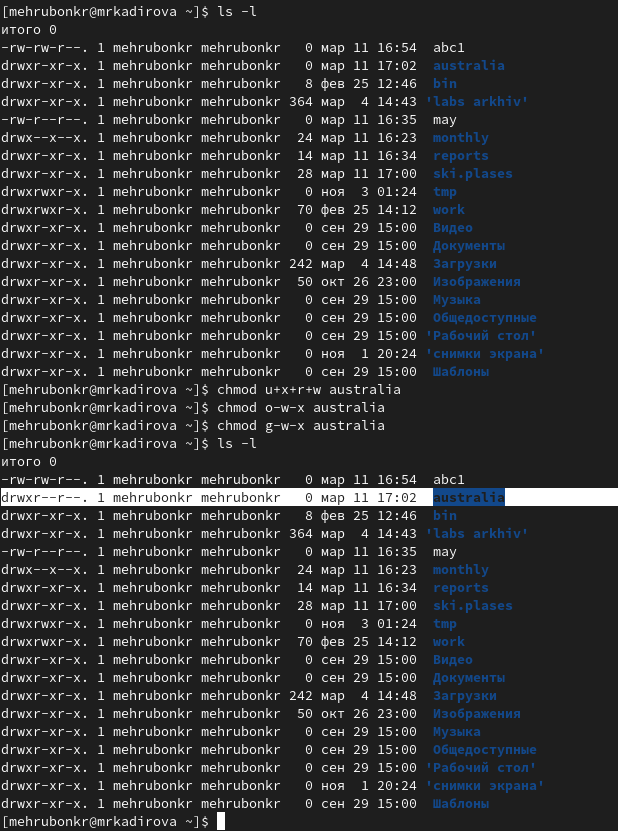
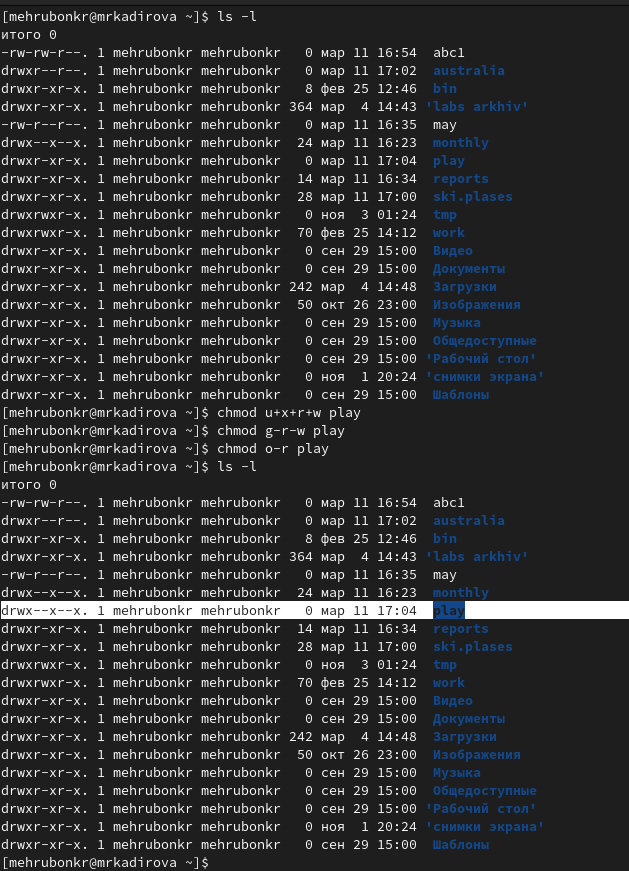
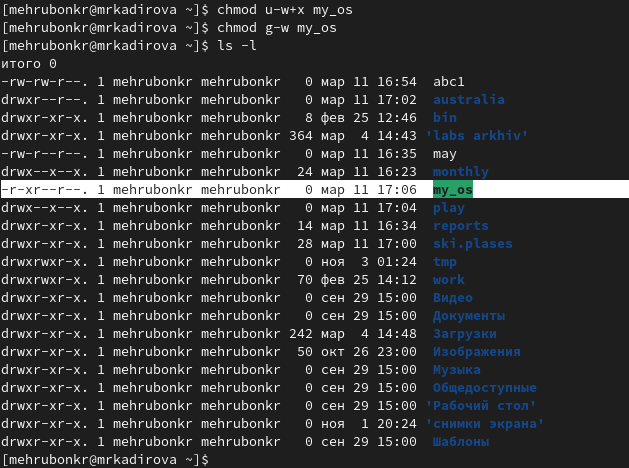
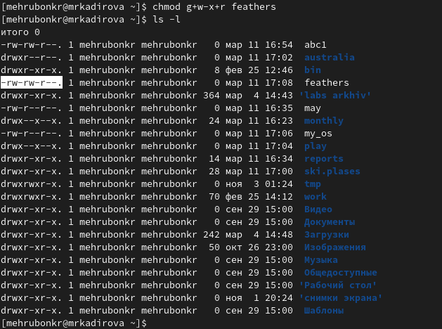
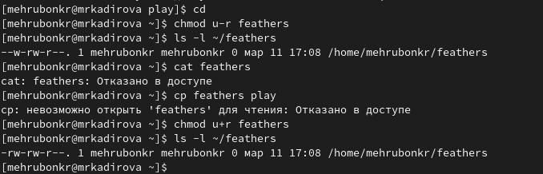
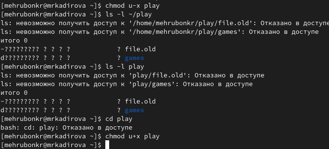

---
## Front matter
lang: ru-RU
title: Лабораторная работа №5
subtitle: Анализ файловой системы. Команды для работы с файлами и каталогами
author:
  - Кадирова М.Р.
institute:
  - Российский университет дружбы народов, Москва, Россия
date: 11.03.2023
## i18n babel
babel-lang: russian
babel-otherlangs: english

## Formatting pdf
toc: false
toc-title: Содержание
slide_level: 2
aspectratio: 169
section-titles: true
theme: metropolis
header-includes:
 - \metroset{progressbar=frametitle,sectionpage=progressbar,numbering=fraction}
 - '\makeatletter'
 - '\beamer@ignorenonframefalse'
 - '\makeatother'
---

# Информация

## Докладчик

  * Кадирова Мехрубон Рахматжоновна
  * Студент группы НКАбд-04-22
  
# Вводная часть

## Цели и задачи

Ознакомление с файловой системой Linux, её структурой, именами и содержанием каталогов. 
Приобретение практических навыков по применению команд для работы с файлами и каталогами, по управлению 
процессами (и работами), по проверке использования диска и обслуживанию файловой системы.

## Указания к работе
- Изучить команды для работы с файлами и каталогами
- Изучить команды для копирование файлов и каталогов
- Изучить команды перемещение и переименование файлов и каталогов
- Изучить права доступа
- Изучить команды для изменения прав доступа
- Анализ файловой системы

# Выполнение лабораторной работы
1. Выполнили все примеры, приведённые в первой части описания лабораторной работы.
2. Выполнили следующие действия, зафиксировав в отчёте по лабораторной 
работе используемые при этом команды и результаты их выполнения:
 * Скопируйте файл /usr/include/sys/io.h в домашний каталог и назовите его equipment. Если файла io.h нет, то используйте любой другой файл в каталоге
/usr/include/sys/ вместо него.
 * В домашнем каталоге создайте директорию /ski.plases.
 * Переместите файл equipment в каталог /ski.plases.
 
## Выполнение лабораторной работы
 
 * Переименуйте файл /ski.plases/equipment в ski.plases/equiplist.
 * Создайте в домашнем каталоге файл abc1 и скопируйте его в каталог ski.plases, назовите его equiplist2.
 * Создайте каталог с именем equipment в каталоге /ski.plases.
 * Переместите файлы /ski.plases/equiplist и equiplist2 в каталог /ski.plases/equipment.
 * Создайте и переместите каталог ~/newdir в каталог /ski.plases и назовите его plans.
  
## Выполнение лабораторной работы
3. Определите опции команды chmod, необходимые для того, чтобы присвоить 
перечисленным ниже файлам выделенные права доступа, считая, что в начале таких прав нет:
 * drwxr--r-- ... australia
 
 
 
## Выполнение лабораторной работы
 * drwx--x--x ... play
 
  
  
## Выполнение лабораторной работы
 * -r-xr--r-- ... my_os
 
   
  
## Выполнение лабораторной работы
 * -rw-rw-r-- ... feathers
 
   

## Выполнение лабораторной работы

4. Проделайте приведённые ниже упражнения, записывая в отчёт по лабораторной
работе используемые при этом команды:
 * Просмотрите содержимое файла /etc/password.
 * Скопируйте файл ~/feathers в файл ~/file.old.
 * Переместите файл ~/file.old в каталог ~/play.
 * Скопируйте каталог ~/play в каталог ~/fun.
 * Переместите каталог ~/fun в каталог ~/play и назовите его games.
 
## Выполнение лабораторной работы

 *  Лишите владельца файла ~/feathers права на чтение. Что произойдёт, если вы попытаетесь просмотреть файл ~/feathers командой
cat? Что произойдёт, если вы попытаетесь скопировать файл ~/feathers? Дайте владельцу файла ~/feathers право на чтение.
 
    
   
## Выполнение лабораторной работы

 * Лишите владельца каталога ~/play права на выполнение. Перейдите в каталог ~/play. Что произошло? Дайте владельцу каталога ~/play право на выполнение.
 
    
   
## Выполнение лабораторной работы

5. Прочитали man по командам mount, fsck, mkfs, kill и кратко их охарактеризовали, приведя примеры.

# Команда mount

Файловая система в Linux состоит из фалов и каталогов. Каждому физическому носителю соответствует своя файловая система. Существует несколько типов файловых систем. Перечислим наиболее часто встречающиеся типы:
– ext2fs (second extended filesystem);
– ReiserFS;
– xfs;
– fat (file allocation table);
– ntfs (new technology file system).
    Для просмотра используемых в операционной системе файловых систем можно вос-
пользоваться командой mount без параметров.

# fsck

С помощью команды fsck можно проверить (а в ряде случаев восстановить) целостность файловой системы.
Формат команды:

```
fsck имя_устройства
```

# Вывод

Ознакомились с файловой системой Linux, её структурой, именами и содержанием каталогов. 
Приобрели практические навыки по применению команд для работы с файлами и 
каталогами, по управлению процессами (и работами), по проверке 
использования диска и обслуживанию файловой системы.
