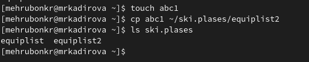

---
## Front matter
title: "Лабораторная работа №5"
subtitle: "Анализ файловой системы Linux.
Команды для работы с файлами и каталогами"
author: "Кадирова Мехрубон Рахматжоновна"

## Generic otions
lang: ru-RU
toc-title: "Содержание"

## Bibliography
bibliography: bib/cite.bib
csl: pandoc/csl/gost-r-7-0-5-2008-numeric.csl

## Pdf output format
toc: true # Table of contents
toc-depth: 2
lof: true # List of figures
lot: true # List of tables
fontsize: 12pt
linestretch: 1.5
papersize: a4
documentclass: scrreprt
## I18n polyglossia
polyglossia-lang:
  name: russian
  options:
	- spelling=modern
	- babelshorthands=true
polyglossia-otherlangs:
  name: english
## I18n babel
babel-lang: russian
babel-otherlangs: english
## Fonts
mainfont: PT Serif
romanfont: PT Serif
sansfont: PT Sans
monofont: PT Mono
mainfontoptions: Ligatures=TeX
romanfontoptions: Ligatures=TeX
sansfontoptions: Ligatures=TeX,Scale=MatchLowercase
monofontoptions: Scale=MatchLowercase,Scale=0.9
## Biblatex
biblatex: true
biblio-style: "gost-numeric"
biblatexoptions:
  - parentracker=true
  - backend=biber
  - hyperref=auto
  - language=auto
  - autolang=other*
  - citestyle=gost-numeric
## Pandoc-crossref LaTeX customization
figureTitle: "Рис."
tableTitle: "Таблица"
listingTitle: "Листинг"
lofTitle: "Список иллюстраций"
lotTitle: "Список таблиц"
lolTitle: "Листинги"
## Misc options
indent: true
header-includes:
  - \usepackage{indentfirst}
  - \usepackage{float} # keep figures where there are in the text
  - \floatplacement{figure}{H} # keep figures where there are in the text
---

# Цель работы

Ознакомление с файловой системой Linux, её структурой, именами и содержанием
каталогов. Приобретение практических навыков по применению команд для работы
с файлами и каталогами, по управлению процессами (и работами), по проверке исполь-
зования диска и обслуживанию файловой системы.

# Задание

1. Выполните все примеры, приведённые в первой части описания лабораторной работы.
2. Выполните следующие действия, зафиксировав в отчёте по лабораторной работе
используемые при этом команды и результаты их выполнения:
- 2.1. Скопируйте файл /usr/include/sys/io.h в домашний каталог и назовите его
equipment. Если файла io.h нет, то используйте любой другой файл в каталоге
/usr/include/sys/ вместо него.
- 2.2. В домашнем каталоге создайте директорию ~/ski.plases.
- 2.3. Переместите файл equipment в каталог ~/ski.plases.
- 2.4. Переименуйте файл ~/ski.plases/equipment в ~/ski.plases/equiplist.
- 2.5. Создайте в домашнем каталоге файл abc1 и скопируйте его в каталог
~/ski.plases, назовите его equiplist2.
- 2.6. Создайте каталог с именем equipment в каталоге ~/ski.plases.
- 2.7. Переместите файлы ~/ski.plases/equiplist и equiplist2 в каталог
~/ski.plases/equipment.
- 2.8. Создайте и переместите каталог ~/newdir в каталог ~/ski.plases и назовите
его plans.
3. Определите опции команды chmod, необходимые для того, чтобы присвоить перечис-
ленным ниже файлам выделенные права доступа, считая, что в начале таких прав
нет:
- 3.1. drwxr--r-- ... australia
- 3.2. drwx--x--x ... play
- 3.3. -r-xr--r-- ... my_os
- 3.4. -rw-rw-r-- ... feathers
При необходимости создайте нужные файлы.
4. Проделайте приведённые ниже упражнения, записывая в отчёт по лабораторной
работе используемые при этом команды:
- 4.1. Просмотрите содержимое файла /etc/password.
- 4.2. Скопируйте файл ~/feathers в файл ~/file.old.
- 4.3. Переместите файл ~/file.old в каталог ~/play.
- 4.4. Скопируйте каталог ~/play в каталог ~/fun.
- 4.5. Переместите каталог ~/fun в каталог ~/play и назовите его games.
- 4.6. Лишите владельца файла ~/feathers права на чтение.
- 4.7. Что произойдёт, если вы попытаетесь просмотреть файл ~/feathers командой
cat?
- 4.8. Что произойдёт, если вы попытаетесь скопировать файл ~/feathers?
- 4.9. Дайте владельцу файла ~/feathers право на чтение.
- 4.10. Лишите владельца каталога ~/play права на выполнение.
- 4.11. Перейдите в каталог ~/play. Что произошло?
- 4.12. Дайте владельцу каталога ~/play право на выполнение.
5. Прочитайте man по командам mount, fsck, mkfs, kill и кратко их охарактеризуйте,
приведя примеры.

# Выполнение лабораторной работы
1. Выполните все примеры, приведённые в первой части описания лабораторной работы.

- Пример 1(рис. @fig:001):

{#fig:001 width=70%}

- Пример 2 (рис. @fig:002)

{#fig:002 width=70%}

- Пример 3 (рис. @fig:003)

{#fig:003 width=70%}

- Пример 4 (рис. @fig:004)

{#fig:004 width=70%}

- Пример 5 (рис. @fig:005)

{#fig:005 width=70%}

- Пример 6 (рис. @fig:006)

{#fig:006 width=70%}

- Пример 7 (рис. @fig:007)

{#fig:007 width=70%}

- Пример 8 (рис. @fig:008)

{#fig:008 width=70%}

- Пример 9 (рис. @fig:009)

 {#fig:009 width=70%}

- Пример 10 (рис. @fig:010)

 {#fig:010 width=70%}
 
- Пример 11 (рис. @fig:011)

{#fig:011 width=70%}

- Пример 12 (рис. @fig:012)

{#fig:012 width=70%}

- Пример 13 (рис. @fig:013)

{#fig:013 width=70%}

- Пример 14 (рис. @fig:014)

{#fig:014 width=70%}

- Пример 15 (рис. @fig:015)

{#fig:015 width=70%}

2. Выполните следующие действия, зафиксировав в отчёте по лабораторной работе используемые при этом команды и результаты их выполнения:

- 2.1. Скопируйте файл /usr/include/sys/io.h в домашний каталог и назовите его equipment. Если файла io.h нет, то используйте любой другой файл в каталоге /usr/include/sys/ вместо него (рис. @fig:016).

{#fig:016 width=70%}

- 2.2. В домашнем каталоге создайте директорию ~/ski.plases (рис. @fig:017).

{#fig:017 width=70%}

- 2.3. Переместите файл equipment в каталог ~/ski.plases (рис. @fig:018).

{#fig:018 width=70%}

- 2.4. Переименуйте файл ~/ski.plases/equipment в ~/ski.plases/equiplist (рис. @fig:019).

{#fig:019 width=70%}

- 2.5. Создайте в домашнем каталоге файл abc1 и скопируйте его в каталог ~/ski.plases, назовите его equiplist2 (рис. @fig:020).

{#fig:020 width=70%}

- 2.6. Создайте каталог с именем equipment в каталоге ~/ski.plases (рис. @fig:021).

{#fig:021 width=70%}

- 2.7. Переместите файлы ~/ski.plases/equiplist и equiplist2 в каталог ~/ski.plases/equipment (рис. @fig:022).

{#fig:022 width=70%}

- 2.8. Создайте и переместите каталог ~/newdir в каталог ~/ski.plases и назовите его plans (рис. @fig:023).

{#fig:023 width=70%}

3. Определите опции команды chmod, необходимые для того, чтобы присвоить перечисленным ниже файлам выделенные права доступа, считая, что в начале таких прав нет:

- 3.1. drwxr--r-- ... australia (рис. @fig:024)

{#fig:024 width=70%}

- 3.2. drwx--x--x ... play (рис. @fig:025)

{#fig:025 width=70%}

- 3.3. -r-xr--r-- ... my_os (рис. @fig:026)

{#fig:026 width=70%}

- 3.4. -rw-rw-r-- ... feathers (рис. @fig:027)

{#fig:027 width=70%}

При необходимости создали нужные файлы.

4. Проделайте приведённые ниже упражнения, записывая в отчёт по лабораторной
работе используемые при этом команды:

- 4.1. Просмотрите содержимое файла /etc/passwd (рис. @fig:028).

{#fig:028 width=70%}

- 4.2. Скопируйте файл ~/feathers в файл ~/file.old (рис. @fig:029).

{#fig:029 width=70%}

- 4.3. Переместите файл ~/file.old в каталог ~/play (рис. @fig:030).

{#fig:030 width=70%}

- 4.4. Скопируйте каталог ~/play в каталог ~/fun (рис. @fig:031).

{#fig:031 width=70%}

- 4.5. Переместите каталог ~/fun в каталог ~/play и назовите его games (рис. @fig:032).

{#fig:032 width=70%}

- 4.6. Лишите владельца файла ~/feathers права на чтение.
- 4.7. Что произойдёт, если вы попытаетесь просмотреть файл ~/feathers командой cat?
- 4.8. Что произойдёт, если вы попытаетесь скопировать файл ~/feathers?
- 4.9. Дайте владельцу файла ~/feathers право на чтение (рис. @fig:033).

{#fig:033 width=70%}

- 4.10. Лишите владельца каталога ~/play права на выполнение.
- 4.11. Перейдите в каталог ~/play. Что произошло?
- 4.12. Дайте владельцу каталога ~/play право на выполнение (рис. @fig:034).

{#fig:034 width=70%}

5. Прочитайте man по командам mount, fsck, mkfs, kill и кратко их охарактеризуйте, приведя примеры. 

- Чтение команды mount (рис. @fig:035).

{#fig:035 width=70%}

- Чтение команды fsck (рис. @fig:036)

{#fig:036 width=70%}

- Чтение команды mkfs (рис. @fig:037)

{#fig:037 width=70%}

- Чтение команды kill (рис. @fig:038)

{#fig:038 width=70%}

# Выводы

    Ознакомились с файловой системой Linux, её структурой, именами и содержанием каталогов. Приобрели практические навыки по применению команд для работы с файлами и каталогами, по управлению процессами (и работами), по проверке использования диска и обслуживанию файловой системы

# Список литературы{.unnumbered}

::: {#refs}
:::
