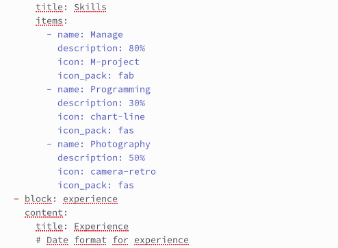
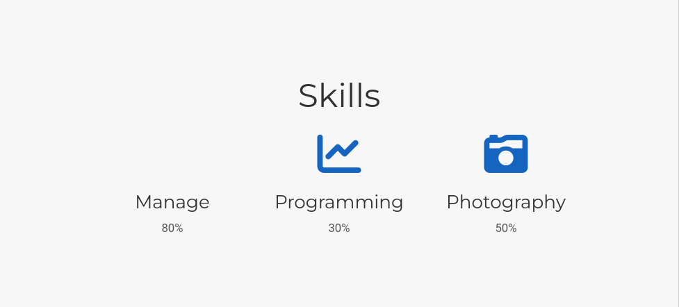
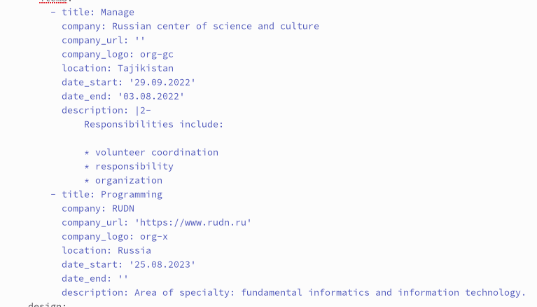
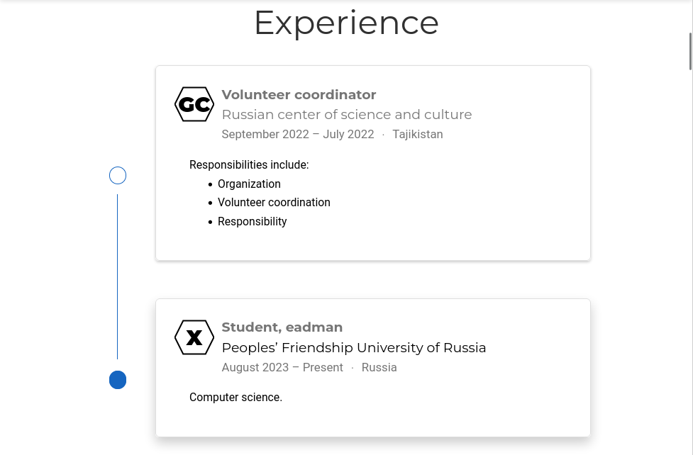
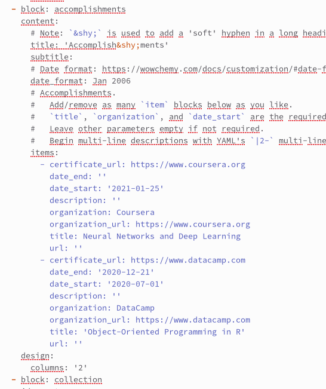
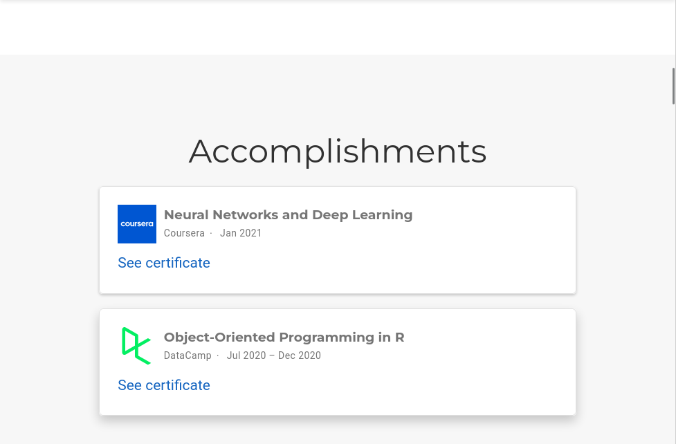
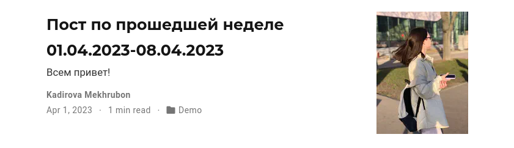
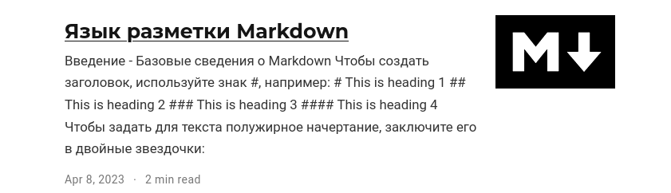

---
## Front matter
lang: ru-RU
title: Индивидуальный проект
subtitle: 4 этап
author:
  - Кадирова М.Р.
institute:
  - Российский университет дружбы народов, Москва, Россия
date: 08 апреля 2023

## i18n babel
babel-lang: russian
babel-otherlangs: english

## Formatting pdf
toc: false
toc-title: Содержание
slide_level: 2
aspectratio: 169
section-titles: true
theme: metropolis
header-includes:
 - \metroset{progressbar=frametitle,sectionpage=progressbar,numbering=fraction}
 - '\makeatletter'
 - '\beamer@ignorenonframefalse'
 - '\makeatother'
---

# Информация

## Докладчик

  * Кадирова Мехрубон Рахматжоновна
  * студентка группы НКАбд-04-22
  * Российский университет дружбы народов

# Цель работы

Создание персонального сайта с помощью Github. Размещение своего проекта на хостинге  git.

# Задание

1. Список достижений.
- Добавить информацию о навыках (Skills).
- Добавить информацию об опыте (Experience).
- Добавить информацию о достижениях (Accomplishments).
2. Сделать пост по прошедшей неделе.
3. Добавить пост на тему по выбору:
- Язык разметки Markdown.

# Выполнение лабораторной работы

1. Список достижений.
- Добавить информацию о навыках (Skills).

{#fig:001 width=40%}

## Список достижений

{#fig:002 width=50%}

##

- Добавить информацию об опыте (Experience).

{#fig:003 width=50%}

## Добавить информацию об опыте (Experience)

{#fig:004 width=50%}

## 

- Добавить информацию о достижениях (Accomplishments).

{#fig:005 width=50%}

## Добавить информацию о достижениях (Accomplishments)

{#fig:006 width=50%}

##

2. Сделать пост по прошедшей неделе.

{#fig:007 width=50%}

##

3. Добавить пост на тему по выбору:
- Язык разметки Markdown.

{#fig:008 width=50%}

# Выводы

Создание персонального сайта с помощью Github. Размещение своего проекта на хостинге  git.
