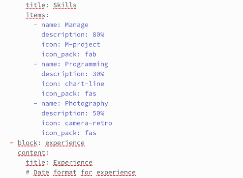
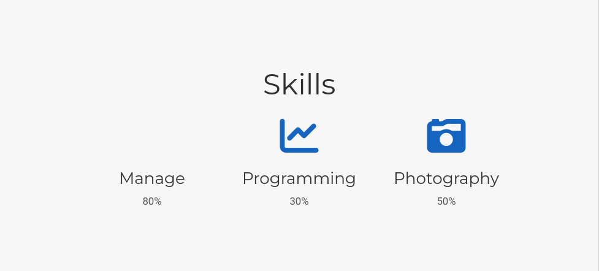
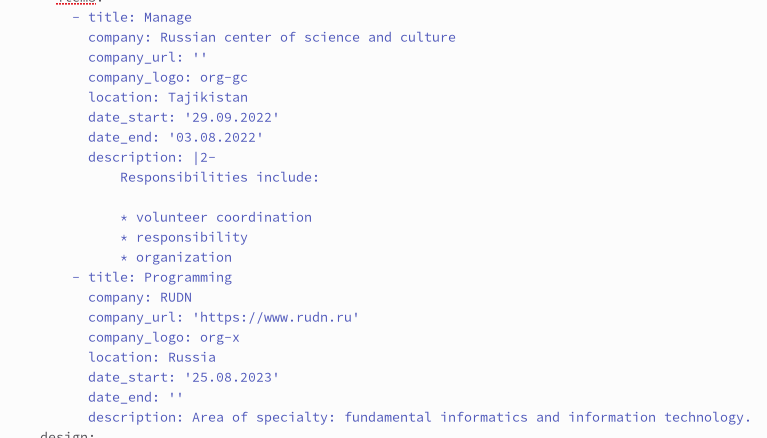
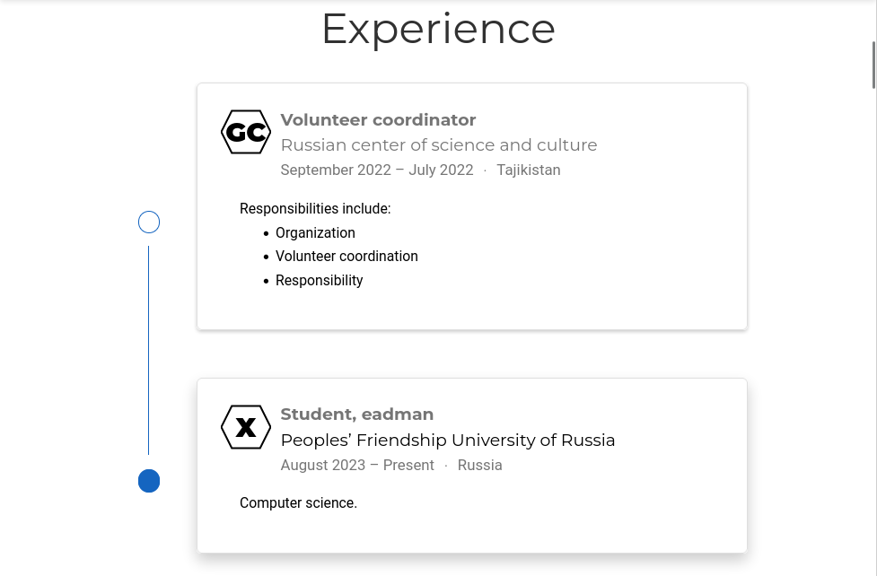
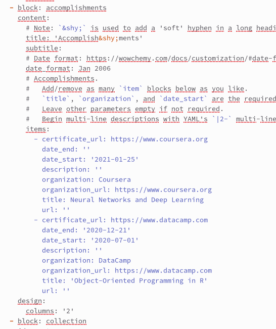
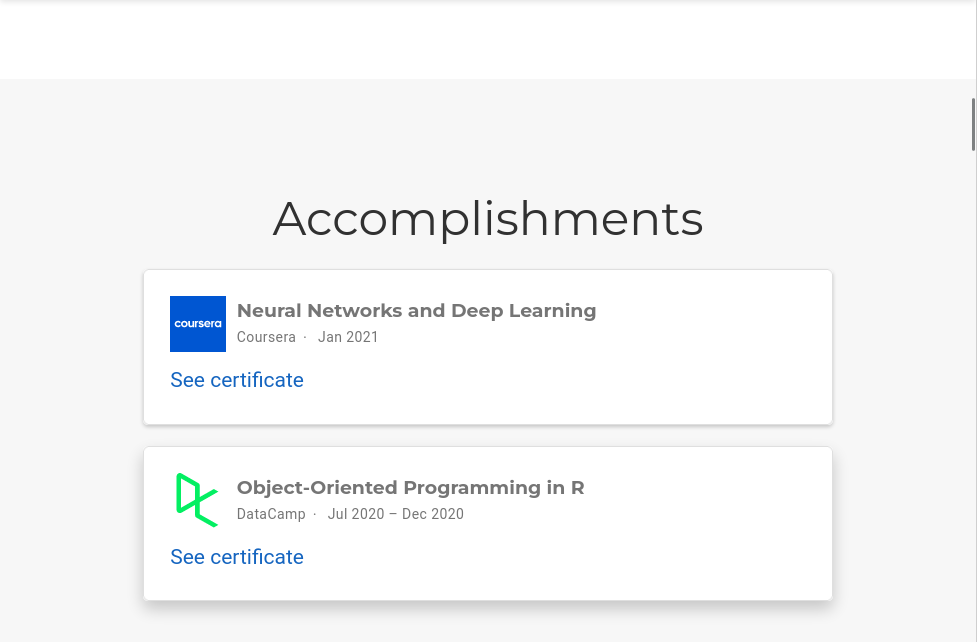
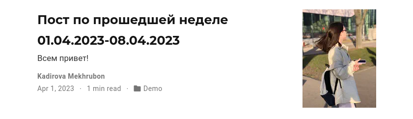
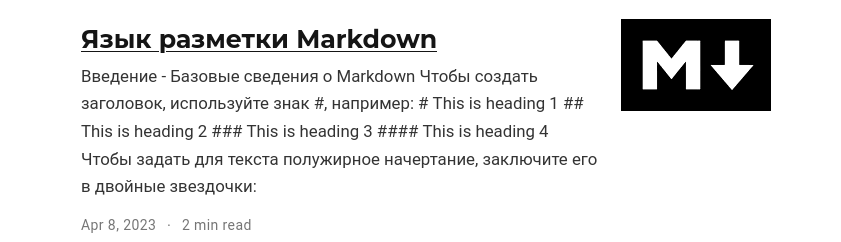

---
## Front matter
title: "Индивидуальный проект"
subtitle: "Этап 4"
author: "Кадирова Мехрубон Рахматжоновна"

## Generic otions
lang: ru-RU
toc-title: "Содержание"

## Bibliography
bibliography: bib/cite.bib
csl: pandoc/csl/gost-r-7-0-5-2008-numeric.csl

## Pdf output format
toc: true # Table of contents
toc-depth: 2
lof: true # List of figures
lot: true # List of tables
fontsize: 12pt
linestretch: 1.5
papersize: a4
documentclass: scrreprt
## I18n polyglossia
polyglossia-lang:
  name: russian
  options:
	- spelling=modern
	- babelshorthands=true
polyglossia-otherlangs:
  name: english
## I18n babel
babel-lang: russian
babel-otherlangs: english
## Fonts
mainfont: PT Serif
romanfont: PT Serif
sansfont: PT Sans
monofont: PT Mono
mainfontoptions: Ligatures=TeX
romanfontoptions: Ligatures=TeX
sansfontoptions: Ligatures=TeX,Scale=MatchLowercase
monofontoptions: Scale=MatchLowercase,Scale=0.9
## Biblatex
biblatex: true
biblio-style: "gost-numeric"
biblatexoptions:
  - parentracker=true
  - backend=biber
  - hyperref=auto
  - language=auto
  - autolang=other*
  - citestyle=gost-numeric
## Pandoc-crossref LaTeX customization
figureTitle: "Рис."
tableTitle: "Таблица"
listingTitle: "Листинг"
lofTitle: "Список иллюстраций"
lotTitle: "Список таблиц"
lolTitle: "Листинги"
## Misc options
indent: true
header-includes:
  - \usepackage{indentfirst}
  - \usepackage{float} # keep figures where there are in the text
  - \floatplacement{figure}{H} # keep figures where there are in the text
---

# Цель работы

Создание персонального сайта с помощью Github. Размещение своего проекта на хостинге  git.

# Задание

1. Список достижений.
- Добавить информацию о навыках (Skills).
- Добавить информацию об опыте (Experience).
- Добавить информацию о достижениях (Accomplishments).
2. Сделать пост по прошедшей неделе.
3. Добавить пост на тему по выбору:
- Язык разметки Markdown.

# Выполнение лабораторной работы

1. Список достижений.
- Добавить информацию о навыках (Skills).

{#fig:001 width=70%}

{#fig:002 width=70%}

- Добавить информацию об опыте (Experience).

{#fig:003 width=70%}

{#fig:004 width=70%}

- Добавить информацию о достижениях (Accomplishments).

{#fig:005 width=70%}

{#fig:006 width=70%}

2. Сделать пост по прошедшей неделе.

{#fig:007 width=70%}

3. Добавить пост на тему по выбору:
- Язык разметки Markdown.

{#fig:008 width=70%}

# Выводы

Создание персонального сайта с помощью Github. Размещение своего проекта на хостинге  git.
